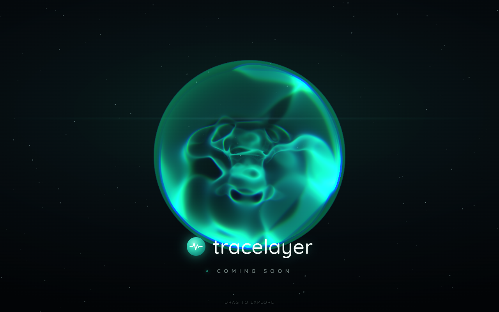

# tracelayer — coming soon

A single-page "coming soon" site for **tracelayer**, built around a WebGL
volumetric fractal orb rendered with a teal → indigo gradient to match the
brand.



## What's here

| Path | Purpose |
| --- | --- |
| `index.html` | The entire site — markup, styles, and the orb (three.js module). |
| `vendor/three/` | three.js r160 core + the addons used (OrbitControls, EffectComposer, RenderPass, ShaderPass, and their deps). Vendored so the site has **no runtime CDN dependency**. |
| `vendor/fonts/` | Self-hosted Quicksand woff2 (the rounded wordmark). |

## The orb

The orb is a ray-marched fractal volume (adapted from the "Magical AI Orb"
shader) tuned to the tracelayer palette:

- **Primary / core:** teal `#2ff0c8` (brand color)
- **Secondary / wisps:** indigo `#4f46e5`
- A soft teal atmosphere halo + subtle chromatic aberration for the glow.

You can drag to rotate it. All the look-and-feel knobs live in the `params`
object near the top of the `<script type="module">` block in `index.html`
(colors, density, rotation speed, fractal iterations, etc.) — the original
tuning GUI was removed for production.

Accessibility & robustness:
- Falls back to a static CSS orb if WebGL is unavailable.
- Honors `prefers-reduced-motion` by calming the animation.

## Running locally

It's static — serve the folder with any static server (ES modules need
`http://`, not `file://`):

```bash
npx serve .
# or
python3 -m http.server 8000
```

Then open the printed URL.

## Deploying

Upload the repository contents as-is to any static host (Netlify, Vercel,
GitHub Pages, S3/CloudFront, Cloudflare Pages, …). No build step. Just make
sure the `vendor/` directory ships alongside `index.html`.
